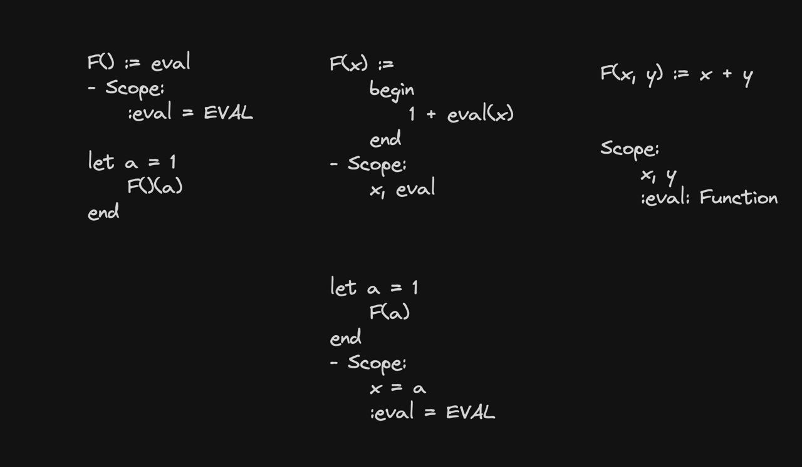
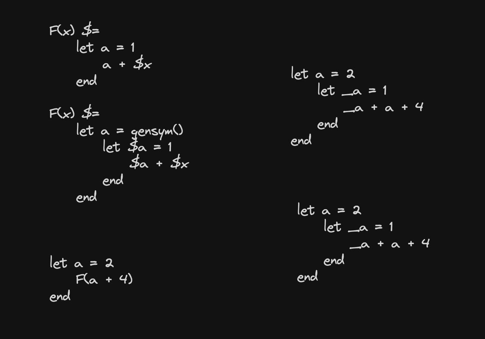

# Notes of the project

## Second part
`fexpr` are considering the scope of the function call, AND NOT the function definition.

`CallScopedEval`: Struct with the arguments for the eval function:
- env of fun definition
- env of fun call

Why both? At the function definition we are binding parameters to arguments. This is in the function creation. 
Binding arguments: get what is passe to the function, put into the env we created initially and we do another important thing: `store eval function within the scope of the function`
So whenever we do a call to the `fexpr` you are passing the arguments to the function and we are calling the eval function that is stored in the scope of the function.

Note: We pass both environment when we call the function: eval scope and call scope.

`**Important thing**`: Imagine having a `fexpr`.
```julia
f(x):=
begin
    y + eval(x)
end

let a = 1
    f(a)
end
```
The function creation will have:
- x
- eval

When we are calling the function, the scope is
- x = a
- :eval = EVAL

So you are going to evaluate 2 times: first to get the binding of the variable and second to evaluate the expression.

There is a edge case: 

```julia

f() := eva;
```
Scope:
- :eval = EVAL

```julia

let a = 1
    f()(a)
end
```

So this is going to return the `eval` in the creation scope and then will be caleld on `a`.




## Third part

A new struct is here: `MetaMacro`

A macro is basically a string if you think about it.

Each time we find the macro symbol, we take the signature, the symbol and we create it.

`Macro creation`: we need 2 environments:
- call env
- definition env: to bind the variables

`Macro call`: we need 2 environments, again. It's the same `handle_call` function we already had.

`Macro gensym`: Gensym is used to avoid shadowing scopes. It's a way to generate a unique symbol, so the variables inside the macro 
will have an unique name.


```julia

f(x) $=
    let a = 1
        a + x
    end

let a = 2
    f(a)
end
```
And we would have inside the macro:

```julia

let a = 1
    a + gensym(x)
end
```

`Macro Expansion`: For each gensym symbol, we are going to interpolate it.

Then we are going to evaluate it in to the call scope.

